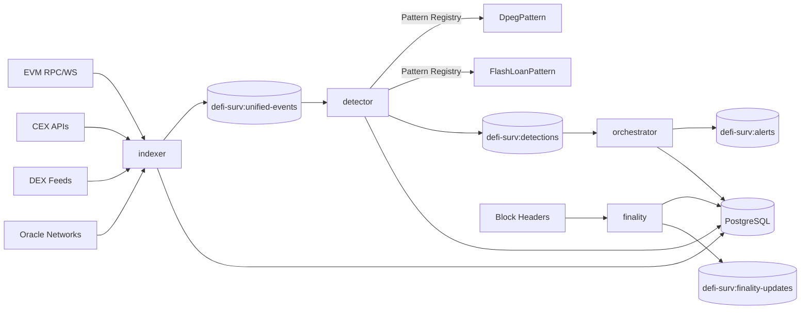

# Core Architecture

## Purpose

`defi-surv-core` is the event-processing and detection runtime. It ingests chain/market signals, evaluates detection logic, manages lifecycle transitions, and emits alerts through shared transport/state.

## Runtime Components

| Component | Binary | Primary Input | Primary Output | Notes |
|---|---|---|---|---|
| Indexer | `apps/indexer` | EVM RPC/WebSocket, CEX/DEX feeds, Oracle sources | `defi-surv:unified-events` | Multi-source supervisor normalizing all event types into UnifiedEvent stream. |
| Detector | `apps/detector` | `defi-surv:unified-events` | `defi-surv:detections` | Pattern registry (DpegPattern, FlashLoanPattern) evaluates events via DetectionPattern trait. |
| Orchestrator | `apps/orchestrator` | `defi-surv:detections` | `defi-surv:alerts` | Correlates detections, applies risk scoring, persists alerts. |
| Finality | `apps/finality` | Block headers, reorg monitoring | `defi-surv:finality-updates` | Tracks confirmation depth and detects blockchain reorganizations. |

## DB-Driven Stream Supervisor (Indexer)

- Stream feed runtime configuration is DB-driven via:
  - `data_sources`
  - `source_stream_configs`
  - `source_stream_tenant_targets`
- For DB-managed stream ingestion, indexer does not use YAML/rules for stream subscription/filter setup.
- Effective activation for a stream worker requires:
  - source enabled (`data_sources.enabled=true`)
  - stream config enabled (`source_stream_configs.enabled=true`)
  - at least one enabled tenant target in `source_stream_tenant_targets`
- Reconciliation uses:
  - `LISTEN source_stream_config_changed` for immediate reaction
  - 30 second full resync fallback
- Raw-first ordering is enforced for stream supervisor events:
  1. parse payload
  2. persist one global row in `raw_events`
  3. fan out tenant-scoped `UnifiedEvent`s to Redis
- `UnifiedEvent` schema remains unchanged; stream metadata is carried in payload (`raw_persisted`, `stream_config_id`, parser context).
- `quote` and `trade` events are automatically purged after 5 minutes (rolling retention). Non-tick events such as `evm_log`/`swap` are not purged by this job.

## System Topology

## Core Data Stores

- PostgreSQL tables (via `infra/sql/*.sql`):
  - Core: `detections`, `alerts`, `alert_lifecycle_events`, `finality_state`
  - Pattern system: `tenant_data_sources`, `tenant_pattern_configs`, `pattern_state`, `pattern_snapshots`
  - Tenant isolation: `detections.tenant_id`, `alerts.tenant_id`
  - Quota management: `usage_events`, `alert_delivery_attempts`
- Redis streams:
  - `defi-surv:unified-events` — All normalized events from indexer (EVM, CEX, DEX, Oracle)
  - `defi-surv:detections` — Pattern detection results
  - `defi-surv:alerts` — Alert lifecycle events
  - `defi-surv:finality-updates` — Block confirmation tracking

## Deployment Model

Source of truth for service shape is `infra/service-catalog.yaml`.

- `test`: cost-minimized ECS profile (single-account, lower desired counts).
- `stage` / `prod`: higher desired counts + managed data/services + stronger failure isolation.
- Deploy strategy defaults by service:
  - Public/interactive surfaces generally `blue_green` (in platform repo).
  - Core stream workers generally `rolling` with consumer groups and circuit-break style fail-fast behavior.

## Reliability and Scaling Notes

- Consumer groups are enabled by default for stream workers and support horizontal scaling.
- Finality and orchestrator logic prevent premature confirmation and support reorg correction.
- Pattern registry in detector enables extensible detection logic via DetectionPattern trait.
- Each pattern (DpegPattern, FlashLoanPattern) maintains isolated state in `pattern_state` and `pattern_snapshots` tables.
- Patterns are configured per-tenant via `tenant_pattern_configs` for multi-tenant isolation.
- Orchestrator enforces tenant monthly alert quota for non-critical alerts while allowing critical bypass.
- Health endpoints are available when `HEALTH_CHECK_ENABLED=true` (`HEALTH_CHECK_PORT`, default `8080`).
