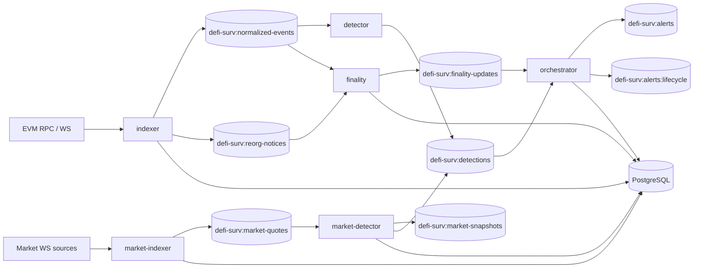

# Core Architecture

## Purpose

`defi-surv-core` is the event-processing and detection runtime. It ingests chain/market signals, evaluates detection logic, manages lifecycle transitions, and emits alerts through shared transport/state.

## Runtime Components

| Component | Binary | Primary Input | Primary Output | Notes |
|---|---|---|---|---|
| Indexer | `apps/indexer` | EVM RPC/WebSocket events | `defi-surv:normalized-events`, `defi-surv:reorg-notices` | Normalizes oracle and flash-loan candidate events. |
| Detector | `apps/detector` | `defi-surv:normalized-events` | `defi-surv:detections` | Applies rule engine + scoring. |
| Scorer | `apps/scorer` | Redis stream events | scored detections | Health-check capable worker for risk enrichment paths. |
| Orchestrator (state manager) | `apps/orchestrator` | `defi-surv:detections`, `defi-surv:finality-updates` | `defi-surv:alerts`, `defi-surv:alerts:lifecycle` | Correlates detections, persists alerts, dispatches notifier calls. |
| Finality | `apps/finality` | `defi-surv:normalized-events`, `defi-surv:reorg-notices` | `defi-surv:finality-updates` | Tracks confirmation depth and reorg impact. |
| Market Indexer | `apps/market-indexer` | External market WS connectors | `defi-surv:market-quotes` | Controlled by `MARKET_DPEG_ENABLED`. |
| Market Detector | `apps/market-detector` | `defi-surv:market-quotes` | `defi-surv:market-snapshots`, `defi-surv:detections` | Computes consensus DPEG outcomes and emits detections when enabled. |

## System Topology

## Core Data Stores

- PostgreSQL tables (via `infra/sql/*.sql`):
  - `detections`, `alerts`, `alert_lifecycle_events`, `finality_state`
  - DPEG extension: `market_quote_ticks`, `market_consensus_snapshots`, `dpeg_alert_state`, `connector_health_state`, `alert_delivery_attempts`
- Redis streams:
  - `defi-surv:normalized-events`
  - `defi-surv:reorg-notices`
  - `defi-surv:finality-updates`
  - `defi-surv:detections`
  - `defi-surv:alerts`
  - `defi-surv:alerts:lifecycle`
  - `defi-surv:market-quotes`
  - `defi-surv:market-snapshots`

## Deployment Model

Source of truth for service shape is `infra/service-catalog.yaml`.

- `test`: cost-minimized ECS profile (single-account, lower desired counts).
- `stage` / `prod`: higher desired counts + managed data/services + stronger failure isolation.
- Deploy strategy defaults by service:
  - Public/interactive surfaces generally `blue_green` (in platform repo).
  - Core stream workers generally `rolling` with consumer groups and circuit-break style fail-fast behavior.

## Reliability and Scaling Notes

- Consumer groups are enabled by default for stream workers and support horizontal scaling.
- Finality and orchestrator logic prevent premature confirmation and support reorg correction.
- Market DPEG path separates quote ingestion and policy evaluation to isolate source instability from alert lifecycle.
- Health endpoints are available when `HEALTH_CHECK_ENABLED=true` (`HEALTH_CHECK_PORT`, default `8080`).
