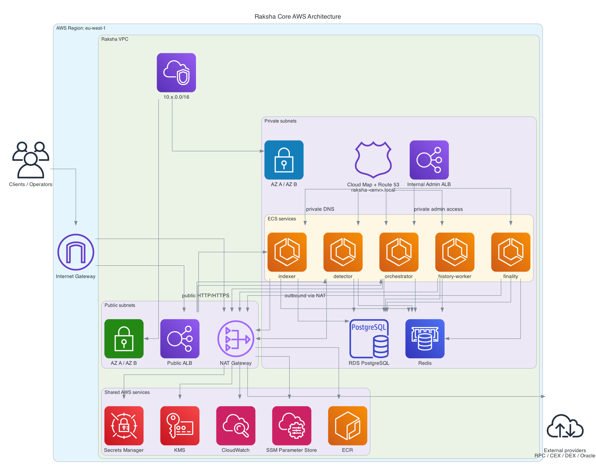
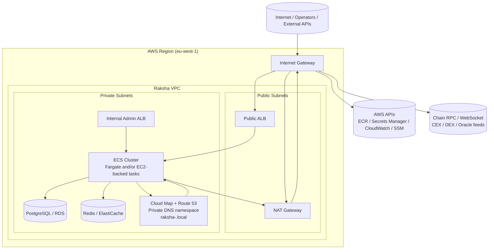
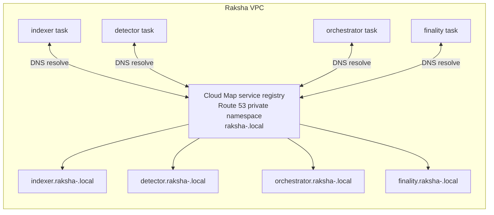

# AWS Architecture

This document describes how the `raksha-core` AWS infrastructure fits together in Terraform, with focus on VPC layout, NAT egress, Route 53 private service discovery, ALBs, ECS, and the managed data tier.

The diagrams below represent the standard managed-data topology used by `stage` and `prod`, and now also by `test` when `enable_managed_data = true`.

## Rendered AWS Diagram

Source: [raksha_core_aws_architecture.py](/Users/sanjaya.rajamantrilage/workspace/blockchain/raksha-labs/raksha-core/docs/diagrams/raksha_core_aws_architecture.py)

## Network Topology

## How It Works

- The VPC spans at least 2 AZs when managed data is enabled, so RDS Multi-AZ and ElastiCache replication groups can use separate private subnets.
- Public subnets hold the internet-facing entry points: Internet Gateway attachment, public ALB, and NAT gateway.
- Private subnets hold the application runtime and stateful services: ECS tasks, internal admin ALB, RDS, Redis, and the private DNS namespace.
- ECS tasks in private subnets do not need inbound internet access. They use the NAT gateway for outbound calls to AWS services and external market or blockchain providers.
- The public ALB sends user or API traffic to public-facing ECS services.
- The internal admin ALB stays inside the VPC and routes admin traffic only from allowed private CIDRs.
- RDS and Redis are reachable only from the ECS task security group.

## Route 53 Private Service Discovery

`raksha-core` uses AWS Cloud Map with a private DNS namespace, which creates Route 53 private DNS records scoped to the VPC.

## Route 53, VPC, and NAT Relationship

- Route 53 private DNS is for east-west traffic inside the VPC.
- NAT is for north-south outbound traffic from private subnets to the internet or AWS public endpoints.
- These solve different problems:
  - Route 53 private namespace: lets services find each other by stable names inside the VPC.
  - NAT gateway: lets private workloads reach external dependencies without becoming publicly reachable.
- Typical request paths:
  - Internal service call: `detector` resolves `orchestrator.raksha-<env>.local` through Route 53 private DNS and connects directly over the VPC.
  - Outbound dependency call: `indexer` reaches Alchemy, exchange APIs, or AWS Secrets Manager via the NAT gateway.
  - Inbound user traffic: client reaches public ALB through the internet gateway, then ALB routes to ECS tasks.

## Raksha-Core AWS Components

- `modules/network`
  - VPC, public/private subnets, route tables, NAT, IGW
- `modules/security`
  - security groups for public ALB, internal admin ALB, ECS tasks, ECS instances, RDS, Redis
- `modules/compute-ecs`
  - ECS cluster, task definitions, services, public/internal ALBs, Cloud Map private namespace
- `modules/data-prod`
  - KMS-encrypted RDS, ElastiCache, and Secrets Manager secrets
- `modules/observability`
  - CloudWatch log groups, alarms
- `modules/cost-controls`
  - budget and anomaly alerting

## Environment Notes

- `test`
  - With `enable_managed_data = true`, the environment uses at least 2 AZs.
  - With `create_nat_gateway = false`, Fargate tasks can be placed in public subnets and get public IPs for low-cost test mode.
- `stage`
  - Managed data, 2 AZs, NAT enabled, internal admin ALB available.
- `prod`
  - Managed data, stronger HA posture, optional per-AZ NAT, public HTTPS/WAF support.
