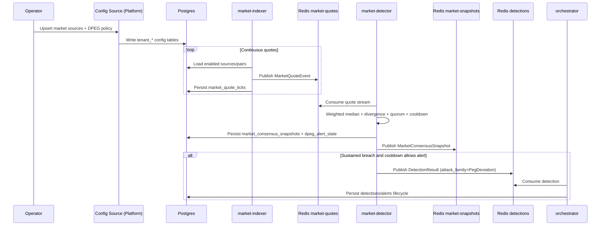

# Scenario: Dollar Depeg Alert

## Goal

Detect sustained depeg on a dollar-pegged market (for example `USDC/USD`) using multi-source quote consensus, then emit a core detection event for normal alert lifecycle handling.

## Preconditions

- Core runtime dependencies are up (`Postgres`, `Redis`).
- Core schema from `infra/sql/001_init.sql`, `infra/sql/002_lifecycle_tenant.sql`, `infra/sql/003_market_dpeg.sql` is applied.
- DPEG configuration tables exist and are populated:
  - `tenant_market_sources`
  - `tenant_market_pairs`
  - `tenant_dpeg_policies`
  - `tenant_dpeg_policy_sources`

These configuration tables are normally created/managed by `defi-surv-platform` `config-service`.

## Required Runtime Flags

```bash
export MARKET_DPEG_ENABLED=true
export DPEG_ALERTS_EMIT_ENABLED=true
```

## End-to-End Sequence



## Local Validation Checklist

1. Quote ingestion is live:
```bash
docker exec -it defi-surv-redis redis-cli XINFO STREAM defi-surv:market-quotes
```

2. Consensus snapshots are being generated:
```bash
docker exec -it defi-surv-redis redis-cli XINFO STREAM defi-surv:market-snapshots
```

3. Snapshot persistence is present:
```bash
docker exec -it defi-surv-postgres psql -U postgres -d defi_surv -c "SELECT tenant_id, market_key, divergence_pct, severity, observed_at FROM market_consensus_snapshots ORDER BY observed_at DESC LIMIT 20;"
```

4. DPEG detections are emitted when breach criteria are met:
```bash
docker exec -it defi-surv-postgres psql -U postgres -d defi_surv -c "SELECT id, protocol, severity, payload->'signals' AS signals, created_at FROM detections ORDER BY created_at DESC LIMIT 20;"
```

## Default Policy Behavior

- `min_sources`: 3
- `quorum_pct`: 0.67
- `sustained_window_ms`: 20000
- `cooldown_sec`: 300
- `stale_timeout_ms`: 15000
- `severity_bands`: `medium=1.0`, `high=3.0`, `critical=5.0`

## Common Failure Modes

- No quotes: connector cannot subscribe/read source; inspect `connector_health_state.last_error`.
- No snapshots: no matching enabled policy/source mapping for `(tenant_id, market_key)`.
- No detections: breach not sustained long enough, quorum not met, or cooldown active.
- Detections present but no alert progression: orchestrator not running or cannot read Redis/Postgres.
