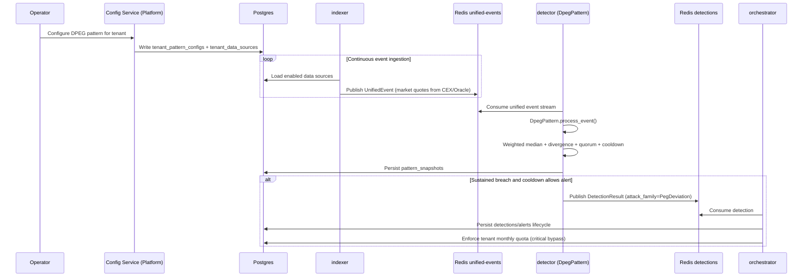

# Scenario: Dollar Depeg Alert

## Goal

Detect sustained depeg on a dollar-pegged market (e.g., `USDC/USD`) using the `DpegPattern` within the detector's pattern registry, then emit a detection event for normal alert lifecycle handling.

## Preconditions

- Core runtime dependencies are up (`Postgres`, `Redis`).
- Core schema from `infra/sql/001_init.sql` and `infra/sql/002_lifecycle_tenant.sql` is applied.
- Pattern configuration tables exist:
  - `tenant_data_sources` — Multi-source data connections (CEX, oracle feeds)
  - `tenant_pattern_configs` — Per-tenant pattern configuration
  - `pattern_state` — Runtime pattern state management
  - `pattern_snapshots` — Historical pattern evaluation snapshots

These configuration tables are normally created/managed by `raksha-platform` `config-service`.

## Architecture Overview

DpegPattern is registered in the detector alongside other patterns (FlashLoanPattern, etc.). It implements the `DetectionPattern` trait:

```rust
pub trait DetectionPattern: Send + Sync {
    fn process_event(&mut self, event: &UnifiedEvent) -> Result<Option<DetectionResult>>;
}
```

The indexer aggregates quotes from multiple sources (Binance, Coinbase, Kraken, etc.) into the unified event stream.

## End-to-End Sequence



## Local Validation Checklist

1. Unified event stream is active:
```bash
docker exec -it raksha-redis redis-cli XINFO STREAM raksha:unified-events
```

2. Pattern snapshots are being generated:
```bash
docker exec -it raksha-postgres psql -U postgres -d raksha -c "SELECT tenant_id, pattern_name, snapshot_data, created_at FROM pattern_snapshots WHERE pattern_name='dpeg' ORDER BY created_at DESC LIMIT 20;"
```

3. DPEG detections are emitted when breach criteria are met:
```bash
docker exec -it raksha-postgres psql -U postgres -d raksha -c "SELECT id, protocol, severity, payload->'signals' AS signals, created_at FROM detections WHERE attack_family='PegDeviation' ORDER BY created_at DESC LIMIT 20;"
```

4. Alert lifecycle tracking:
```bash
docker exec -it raksha-postgres psql -U postgres -d raksha -c "SELECT id, tenant_id, lifecycle_state, severity, created_at FROM alerts ORDER BY created_at DESC LIMIT 20;"
```

## Default Policy Behavior

- `min_sources`: 3
- `quorum_pct`: 0.67
- `sustained_window_ms`: 20000
- `cooldown_sec`: 300
- `stale_timeout_ms`: 15000
- `severity_bands`: `medium=1.0`, `high=3.0`, `critical=5.0`

## Common Failure Modes

- No unified events: indexer cannot connect to data sources; check `tenant_data_sources` configuration.
- No pattern snapshots: no matching `tenant_pattern_configs` entry for DPEG pattern.
- No detections: breach not sustained long enough, quorum not met, or pattern cooldown active.
- Alert row is `suppressed`: tenant hit `max_alerts_per_month`; verify non-critical quota behavior and critical bypass.
- Detections present but no alert progression: orchestrator not running or cannot read Redis/Postgres.
- Pattern state corruption: check `pattern_state` table for stale entries, verify detector restart clears locks.
