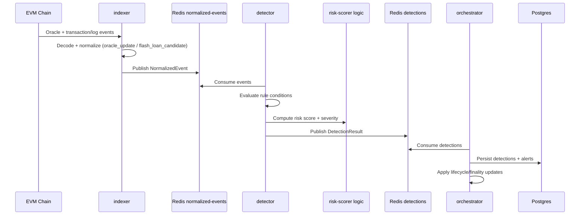

# Scenario: Flash-Loan Attack Detection

## Goal

Detect suspicious flash-loan-driven manipulation and emit a detection that enters the normal alert lifecycle pipeline.

## Current Rule Gates

Relevant rules currently require flash-loan and/or swap/divergence signals, for example:
- `rules/chains/ethereum/protocols/lending/oracle_divergence.yaml`
- `rules/chains/base/protocols/perp/perp_oracle_skew.yaml`

Typical condition keys used:
- `flash_loan_required`
- `large_swap_required`
- `divergence_pct_gt`

## Important Configuration Note

`indexer` can decode flash-loan candidate events only when `flash_loan_sources` are configured in chain `protocol_config.yaml` (`crates/ingestion/src/config.rs` schema).

If these sources are not configured, flash-loan candidate signal volume will be limited to what upstream event metadata already provides.

## End-to-End Sequence



## Local Test Strategy

### 1. Unit and contract tests (recommended first)

```bash
cargo test -p ingestion decode_flash_loan
cargo test -p detection-engine
cargo test -p risk-scorer
```

### 2. Runtime smoke test

1. Start deps and core workers (`indexer`, `detector`, `orchestrator`, `finality`).
2. Feed chain events (live RPC or synthetic harness).
3. Validate detection stream/table updates:

```bash
docker exec -it defi-surv-redis redis-cli XINFO STREAM defi-surv:detections
docker exec -it defi-surv-postgres psql -U postgres -d defi_surv -c "SELECT id, tx_hash, protocol, severity, created_at FROM detections ORDER BY created_at DESC LIMIT 20;"
```

### 3. Rule-focused regression check

When editing flash-loan rule conditions:
- keep `flash_loan_required` and threshold semantics explicit,
- verify no alert flood for benign high-volume activity,
- verify severe scenarios still escalate to expected severity.

## Operational Failure Modes

- Flash signal missing: no `flash_loan_sources` mapping or decode mismatch.
- Detector sees events but no detections: condition thresholds too strict or required signals absent.
- Detections present but no alert lifecycle progression: orchestrator/finality path unavailable.
- False positives during volatile markets: tighten rule windows/thresholds and review signal combinations.
