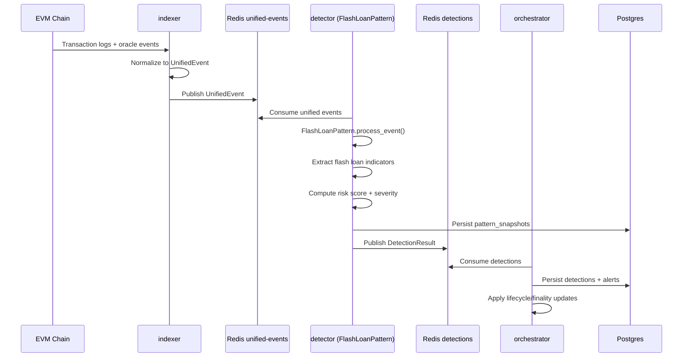

# Scenario: Flash-Loan Attack Detection

## Goal

Detect suspicious flash-loan-driven manipulation using the `FlashLoanPattern` within the detector's pattern registry and emit a detection that enters the normal alert lifecycle pipeline.

## Pattern Architecture

FlashLoanPattern is one of the registered patterns in `apps/detector/src/patterns/flash_loan.rs`. It implements the `DetectionPattern` trait:

```rust
pub trait DetectionPattern: Send + Sync {
    fn process_event(&mut self, event: &UnifiedEvent) -> Result<Option<DetectionResult>>;
}
```

The pattern evaluates UnifiedEvents from the indexer looking for flash loan indicators in transaction metadata.

## Configuration Requirements

The indexer normalizes EVM events into UnifiedEvents. Flash loan detection requires:
- Transaction logs containing flash loan borrow/repay patterns
- Oracle update events for price manipulation detection
- Swap events for volume/complexity analysis

Pattern-specific configuration is stored in `tenant_pattern_configs` table with JSON policy data.

## End-to-End Sequence



## Local Test Strategy

### 1. Unit and pattern tests (recommended first)

```bash
cargo test -p indexer
cargo test -p detector flash_loan
cargo test -p risk-scorer
```

### 2. Runtime smoke test

1. Start deps and core workers (`indexer`, `detector`, `orchestrator`, `finality`).
2. Feed chain events (live RPC or synthetic test harness from simlab).
3. Validate detection stream/table updates:

```bash
docker exec -it defi-surv-redis redis-cli XINFO STREAM defi-surv:detections
docker exec -it defi-surv-postgres psql -U postgres -d defi_surv -c "SELECT id, tx_hash, protocol, severity, attack_family, created_at FROM detections WHERE attack_family='FlashLoan' ORDER BY created_at DESC LIMIT 20;"
```

### 3. Pattern state verification

Check pattern snapshots and state persistence:

```bash
docker exec -it defi-surv-postgres psql -U postgres -d defi_surv -c "SELECT tenant_id, pattern_name, snapshot_data FROM pattern_snapshots WHERE pattern_name='flash_loan' ORDER BY created_at DESC LIMIT 10;"
```

## Operational Failure Modes

- Flash loan signals missing: UnifiedEvent payload lacks flash loan indicators; verify indexer event normalization.
- Detector sees events but no detections: pattern thresholds too strict or required signals absent; check `tenant_pattern_configs`.
- Detections present but no alert lifecycle progression: orchestrator/finality path unavailable or Redis stream lag.
- False positives during volatile markets: adjust pattern cooldown periods and signal combination logic in `FlashLoanPattern`.
- Pattern state locks: stale entries in `pattern_state` table; verify detector instances clear locks on shutdown.
